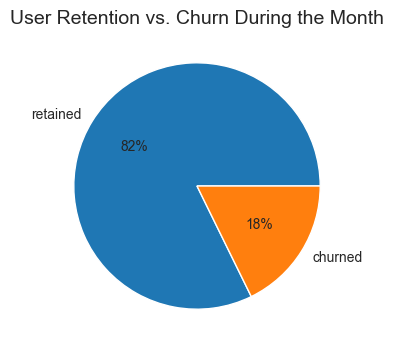
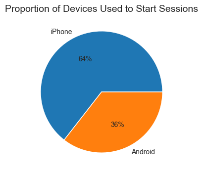
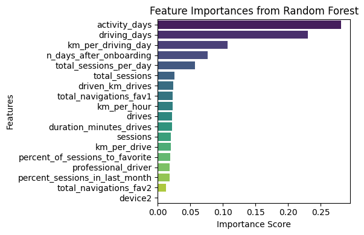
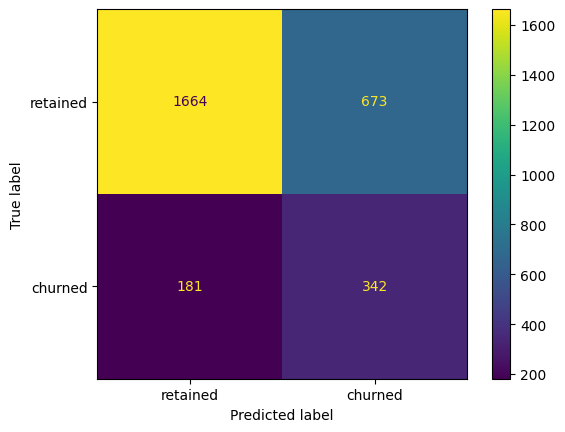

**Predicting and Understanding User Churn in Waze**

**Overview**

The goal of this project was to develop a logistic regression and Random Forest model to predict
whether a Waze user would churn or be retained. The analysis was conducted using user behavior data,
including sessions, navigation patterns, and driving activity. Engineered features such as activity_days,
km_per_driving_day, and percent_of_sessions_to_favorite ranked among the top predictors of churn.
Among the models tested, the Random Forest classifier achieved the best performance for the business goal,
with a recall of 65.4%, precision of 33.7%, F1 score of 44.5%, and accuracy of 70.1% on the test set.
Although the model had a relatively high number of false positives, it successfully identified 342 of
the 523 actual churners, prioritizing recall to minimize the risk of missing at-risk users.
These findings offer actionable insights to inform targeted retention strategies.

**Business Understanding**

User churn poses a significant challenge for navigation apps like Waze, as losing active users directly
impacts growth and engagement. Understanding what drives users to stop using the app helps inform targeted
strategies to retain them.

**Data Understanding**

The dataset consists of 14,999 rows and 13 columns, with 11 numeric and 2 categorical variables.
There are 700 missing values in the churn label, likely due to unknown churn status, and these are evenly
distributed by device type. Approximately 82% of users are retained while 18% have churned.
Churned users tend to drive more frequently, farther, and for longer durations over fewer days than
retained users—indicating a possible subgroup of “super-drivers.” Additionally, no significant difference
in churn behavior is observed between iPhone and Android users.

**Modeling and Evaluation**

For this project, several models were explored to predict user churn, with a focus on feature engineering
to improve model performance. Six of the top 10 most important predictors were engineered features, including
activity_days, km_per_driving_day, total_sessions_per_day, km_per_hour, km_per_drive, and percent_of_sessions_to_favorite.
Among the models tested, the Random Forest classifier outperformed XGBoost, particularly in terms of recall,
making it the preferred choice for this task.
On the test set, the Random Forest model achieved a recall of 65.4%, precision of 33.7%, F1 score of 44.5%,
and accuracy of 70.1%. The confusion matrix showed that the model correctly predicted 342 out of 523 churned users,
with 181 false negatives and 673 false positives. Although the precision was lower, the high recall aligns
with business priorities, as it is more critical to capture actual churners than to misclassify retained users.
Feature importance analysis revealed that user activity metrics—such as activity_days, driving_days,
and km_per_driving_day—were the strongest indicators of churn.

**Conclusion**

This model can help Waze identify users at risk of churn, enabling targeted engagement strategies to improve retention.
In the future, incorporating additional user behavior data, such as in-app interactions and feedback, could further
enhance the model’s predictive power and drive more effective retention strategies.
